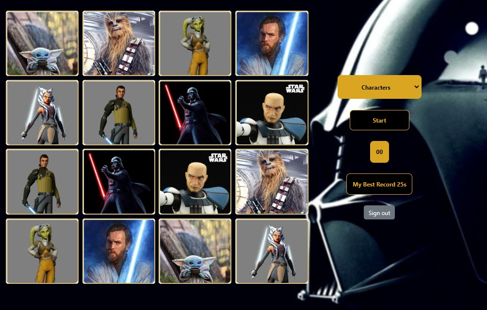
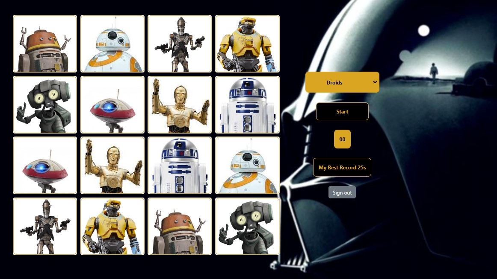
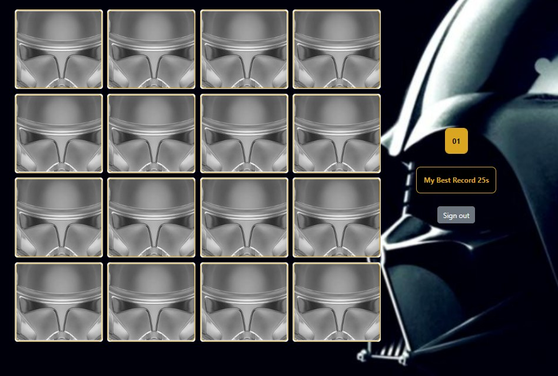

## Database


###

Connection file `./services/db`

 ### Migration
 
```
node db/migrate/index.js

```

### Seed

```
node db/seed/index.js
```


### Sample views 
Droid View         |  Character Views | Game Cover
:-------------------------:|:-------------------------:|:-------------------------:
  |  |  


<p float="center">
  
   
  
</p>